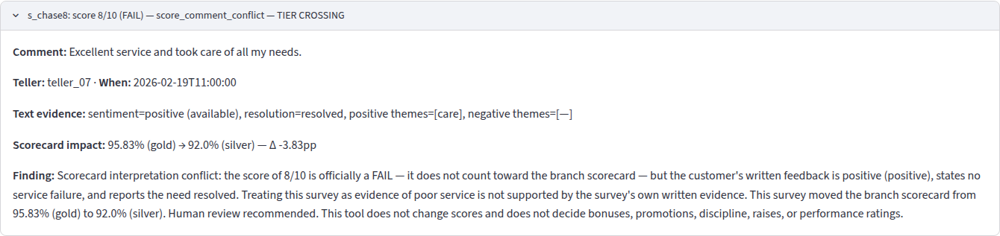
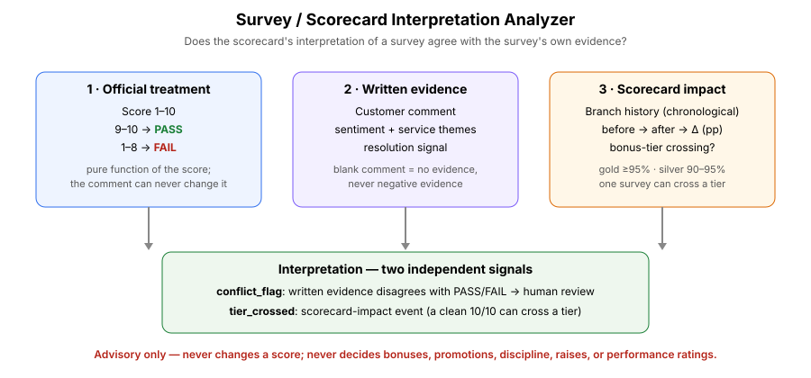
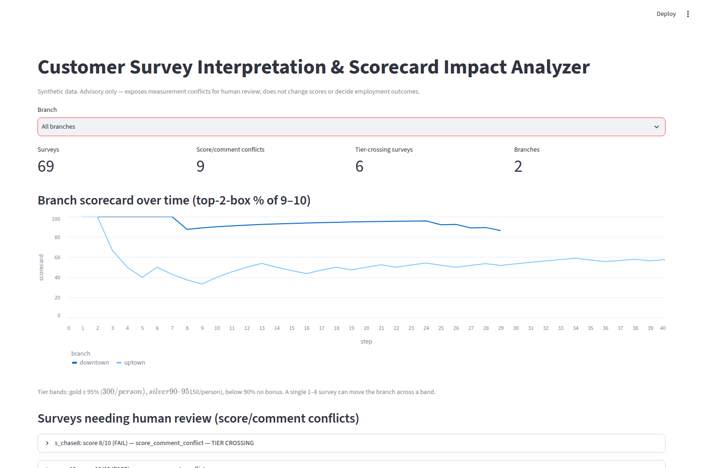
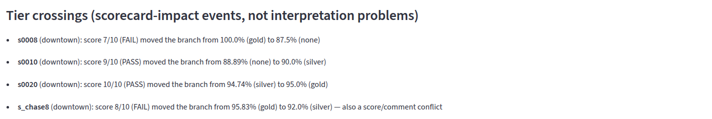

# Customer Survey Interpretation & Scorecard Impact Analyzer

> The company asks customers for both a 1–10 score and a written comment, but only the number actually matters. An 8 counts as a failure even if the customer says the service was excellent. This system detects those contradictions and shows how much each survey affects the branch score, so managers can see when the scorecard may not accurately represent the service the customer described.

**One-sentence technical version:** a survey-consistency analyzer that compares the scorecard's binary interpretation of a customer rating with the customer's written feedback and quantifies the survey's impact on aggregate performance metrics.

## The problem

Branch scorecards are computed as a **top-2-box percentage**: the share of surveys scoring 9–10. Everything else follows from that one design choice:

- **Threshold cliff.** 9–10 = PASS, 1–8 = FAIL. An 8 and a 9 are one point apart in customer behavior but have opposite organizational consequences. An 8 with *"Excellent service and took care of all my needs"* is treated identically to a 2 with *"terrible service."*
- **Information loss.** The survey collects two sources of evidence (score + comment) but the scorecard effectively throws the second one away.
- **Scorecard sensitivity.** With a small survey count, a single response can move a branch across a bonus tier (gold ≥ 95% → $300/person; silver 90–95% → $150/person).

The motivating case, reproduced as a synthetic fixture: a branch at 95.83% (gold) receives an 8/10 whose comment reads *"Excellent service and took care of all my needs."* The scorecard drops to 92.0% (silver) — a gold→silver tier crossing on a survey that describes good service.





## What the system does

The question being measured is **not** "was the customer's score wrong?" It is:

> "Does the scorecard's interpretation of the numeric response agree with what the customer actually wrote?"

Each survey is analyzed across **three independent dimensions**:

```
CUSTOMER SURVEY
      │
      ├── Number ─────────► Official PASS/FAIL
      │                     │
      │                     └──► Scorecard impact / tier crossing
      │
      └── Comment ────────► Written evidence
                              │
                              ▼
                Compare evidence with PASS/FAIL
                              │
                    conflict / consistent
```

1. **Official scorecard treatment** — PASS / FAIL. A *pure function of the score*; the comment can never change it (tested). Scorecard mathematics are likewise score-only.
2. **Written-feedback evidence** — sentiment, service themes, and a resolution signal (resolved / unresolved / unknown) extracted from the comment. A blank comment is *no evidence*, never negative evidence.
3. **Scorecard impact** — the branch scorecard before → after each survey (chronological), the percentage-point delta, and whether the survey crossed a bonus tier. An impact event, not an interpretation problem.

Interpretation statuses: `score_comment_conflict` (either direction — a FAIL with positive resolved text, or a PASS with negative unresolved text), `consistent_with_official_treatment`, `insufficient_text_evidence`, `text_inconclusive`, `not_screened` (old-way cohort: the scorecard-only method never examines written feedback).



### Two independent signals

A survey can carry either, both, or neither:

- `conflict_flag` — the scorecard's binary treatment of the score disagrees with the written evidence. **This is what warrants human review** (`needs_human_review`).
- `tier_crossed` — the survey moved the branch across a bonus tier. Important to surface, but a clean 10/10 lifting a branch from silver to gold is not an interpretation problem.



The original example, stated simply: the customer gave an 8 and wrote that the service was excellent and all needs were handled. The scorecard treats the 8 as a failure because only 9s and 10s count. The program doesn't change the 8 — it shows that the scorecard is treating the survey as negative while the written feedback describes a positive experience, and it shows how much that one survey moved the branch score.

## What the system never does

Because these metrics touch employment outcomes, the boundary is hard:

- It never changes a score or the official PASS/FAIL treatment, and never decides bonuses, promotions, discipline, raises, or performance ratings.
- It does show one explicit what-if: the **adjusted ("truer") scorecard**, where a `score_comment_conflict` survey counts the way its written evidence reads (an 8/10 with a great comment counts as a pass; a 10/10 with a hostile unresolved comment counts as a fail). Deterministic rule, separate columns, official scorecard untouched — every conflict rationale still ends with an explicit advisory footer: *Human review recommended.*

## Quickstart (deterministic)

```bash
python3 -m venv .venv && source .venv/bin/activate
pip install -r requirements.txt
python3 scripts/gen_surveys.py   # deterministic synthetic data (seed=42)
python3 src/main.py              # analyze -> data/analyzed_surveys.csv + data/report.txt
python3 -m unittest discover -s tests
streamlit run app/streamlit_app.py
```

Optional: `--sentiment comprehend` routes comment sentiment through Amazon Comprehend (batch, opt-in). The honest contract: **official PASS/FAIL treatment and scorecard mathematics are completely independent of sentiment. Sentiment is used only to interpret the written comment and identify score/comment conflicts; it can never alter the customer's score, official treatment, scorecard, bonus tier, or employment outcome.**

## Results (synthetic data)

24,021 surveys across 1,000 branches in two cohorts of 500, generated from the same survey distributions (controlled comparison):

- **New way (analyzer, 500 branches / 12,021 surveys)** → **2,007 score/comment conflicts** surfaced for human review (the planted fixtures plus emergent conflicts elsewhere in the synthetic dataset — demonstrating that the detector is not limited to hand-authored fixtures), **262 tier-crossing surveys**, 8,242 consistent, 1,771 inconclusive, 1 insufficient text evidence.
- **Old way (scorecard only, 500 branches / 12,000 surveys)** → 255 tier crossings, **0 conflicts surfaced** — the interpretation layer is never applied (`interpretation_status = not_screened`), so every score/comment conflict in these branches goes unflagged by construction.

**Adjusted ("truer") scorecard (new way):** 2,007 surveys reclassified by their written evidence; 83 official tier crossings avoided in the adjusted view. The motivating case: the 8/10 with "Excellent service and took care of all my needs." drops downtown 95.83% gold → 92.0% silver officially, but 95.83% gold → 96.0% gold adjusted — the branch keeps the tier its customers' words say it earned.

**40/40 automated tests pass.**

## Resume bullet

Built a survey-consistency analyzer that cross-checks a branch scorecard's binary pass/fail interpretation of 1–10 customer ratings against written-feedback evidence and quantifies each survey's marginal impact on aggregate metrics — reproducing a real-world case where an 8/10 with an "excellent service" comment dropped a branch from gold to silver bonus tier — surfacing interpretation conflicts for human review without altering scores or employment decisions. Validated on 24,021 synthetic surveys across 1,000 branches in a controlled old-way-vs-new-way comparison (500 branches each): the analyzer surfaced 2,007 conflicts the scorecard-only method leaves buried, and the adjusted "truer" scorecard shows the motivating 8/10 keeping its branch at gold (96.0%) instead of dropping it to silver (92.0%). 40/40 automated tests passing.
